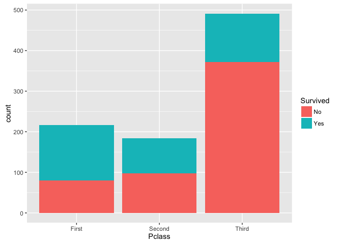
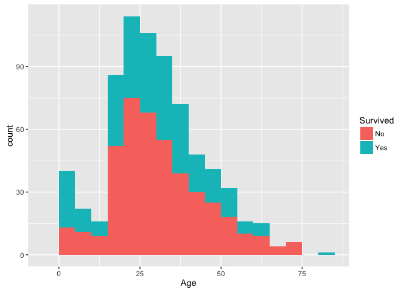
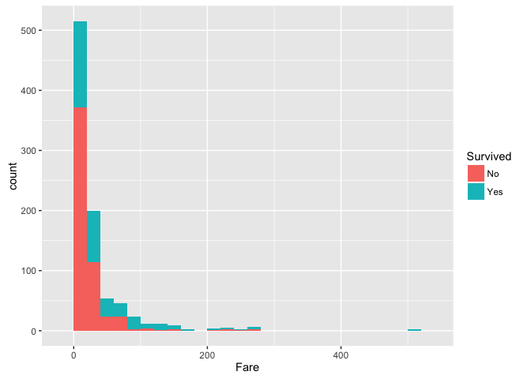
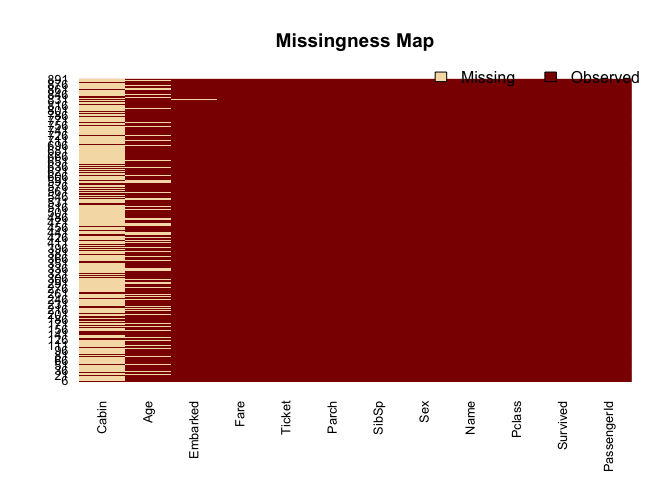
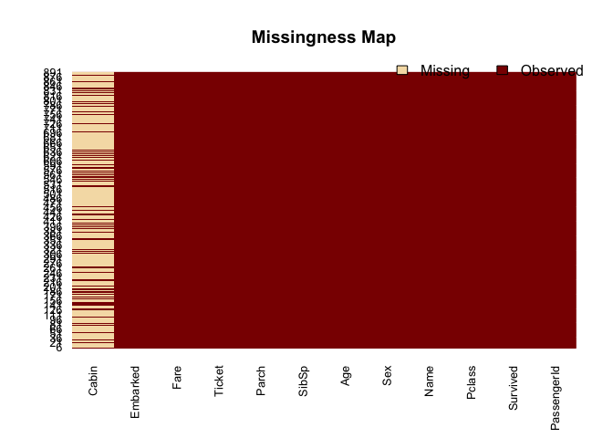

# Titanic Survival Prediction

## Introduction
This file describes how I solve Kaggle's [Titanic: Machine Learning from Disaster](https://www.kaggle.com/c/titanic) competition. 

### Prepare the environment

```r
library(knitr)
opts_chunk$set('results' = 'hold', 'message' = FALSE, 'warning' = FALSE)
library(plyr)
library(ggplot2)
library(Amelia)
library(caret)
```

## Data exploring and pre-processing

Load the training and testing data from files.

```r
column.types <- c('integer',   # PassengerId
                        'factor',    # Survived 
                        'factor',    # Pclass
                        'character', # Name
                        'factor',    # Sex
                        'numeric',   # Age
                        'integer',   # SibSp
                        'integer',   # Parch
                        'character', # Ticket
                        'numeric',   # Fare
                        'character', # Cabin
                        'factor'     # Embarked
)
train <- read.csv('train.csv', colClasses = column.types, na.strings = c('NA', ''))
test <- read.csv('test.csv', colClasses = column.types[-2], na.strings = c('NA', ''))

## Rename some factor variables, since these factor names are not proper.
train$Survived <- revalue(train$Survived, c('1' = 'Yes', '0' = 'No'))
train$Pclass <- revalue(train$Pclass, c('1' = 'First', '2' = 'Second', '3' = 'Third'))

df.train1 <- train
```

First, let's see how the variables affect the survive rate.

```r
#mosaicplot(Pclass ~ Survived, data = df.train1, main = 'Survival Rate by Passenger Class', color = TRUE)
#mosaicplot(Sex ~ Survived, data = df.train1, main = 'Survival Rate by Gender', color = TRUE)
#mosaicplot(Embarked ~ Survived, data = df.train1, main = 'Survival Rate by Ports', color = TRUE)
#barplot(table(df.train1$Embarked))
p <- ggplot(df.train1)
p + geom_bar(aes(Pclass, fill = Survived))
```

 

```r
p + geom_bar(aes(Sex, fill = Survived))
```

 

```r
p + geom_bar(aes(Embarked, fill = Survived))
```

 

```r
p + geom_histogram(aes(Age, fill = Survived), binwidth = 5)
```

 

```r
p + geom_histogram(aes(Fare, fill = Survived), binwidth = 20)
```

 

From these figures, we have the following observations:

* The passengers of the first class have a better survival rate than those of the third class.
* The female and children have a larger chance to survive.
* The embarked port doesn't affect the survival rate much.
* The passengers paying a higher fare seem to have a better survival than those paying less.


Use *missmap* function from the package **Amelia** to show the missing values in the data. 

```r
missmap(df.train1)
```

 

We can see that the variables Cabin, Age and Embarked contain missing values, where Embarked has only one missing values, which is easy to fix by assigning it the most popular value, and Cabin has too many missing values, which we may not consider the whole class in our model. So the only problem left is how to deal with the variable Age. The first thought is to assign all missing values the average of other values.

```r
df.train1[is.na(df.train1$Age), 'Age'] <- mean(df.train1$Age, na.rm = TRUE)
df.train1$Embarked[is.na(df.train1$Embarked)] <- 'S'
missmap(df.train1)
```

 

## Data Modeling
First, split df.train1 into two sets: a training set (80%) and a test set (20%).

```r
set.seed(11)
train.rows <- createDataPartition(y = df.train1$Survived, p = 0.8, list = FALSE)
df.t <- df.train1[train.rows,]
df.v <- df.train1[-train.rows,]
dim(df.t)
dim(df.v)
```

```
## [1] 714  12
## [1] 177  12
```

### Model using random forest

You will use function train from package caret in the following section.

```r
cv.ctrl <- trainControl(method = 'repeatedcv', number = 10, 
                     repeats = 5, summaryFunction = twoClassSummary, classProbs = TRUE)
rf.param = data.frame(.mtry = c(2,3))
set.seed(18)
rf.tune1 <- train(Survived ~ Sex + Pclass + Age + SibSp + Parch + Embarked, data = df.t, 
                           method = 'rf', metric = 'ROC', tuneGrid = rf.param, trControl = cv.ctrl)
```


